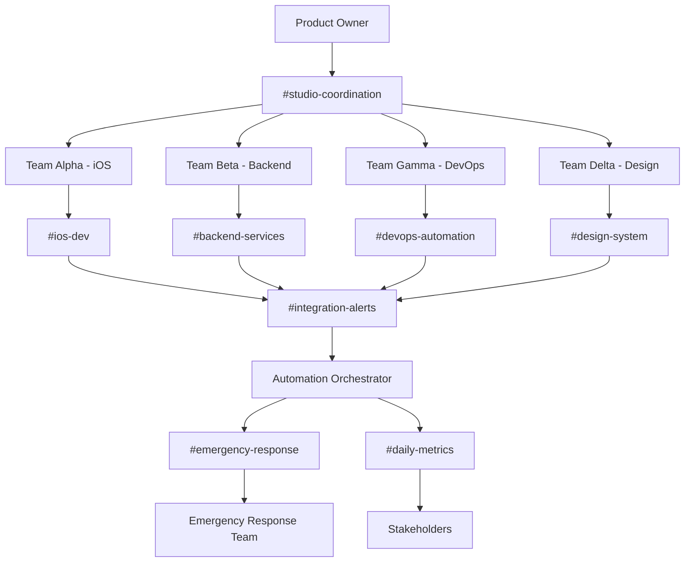

# PiggyBong Team Communication & Sync Protocols
## Studio-Wide Communication Framework for 6-Day Cycles

---

## 🎯 Communication Strategy Overview

This document establishes comprehensive communication and synchronization protocols for the PiggyBong iOS project, ensuring seamless information flow between Mobile Development, Backend Services, GitHub Workflows, and Design System Management teams throughout rapid 6-day development cycles.

---

## 📡 Communication Architecture

### **Communication Channels Structure**
```yaml
# Studio communication channel topology
communication_channels:
  primary_coordination:
    channel: "#studio-coordination"
    purpose: "Cross-team decisions and coordination"
    participants: ["all_team_leads", "project_manager", "product_owner"]
    activity_level: "high"
    response_time: "< 2 hours during work hours"
    
  team_specific:
    ios_development:
      channel: "#ios-dev"
      purpose: "iOS development discussions and code reviews"
      participants: ["alpha_team", "tech_leads"]
      activity_level: "high"
      response_time: "< 1 hour"
      
    backend_services:
      channel: "#backend-services"
      purpose: "API development and database discussions"
      participants: ["beta_team", "database_specialists"]
      activity_level: "medium"
      response_time: "< 2 hours"
      
    devops_automation:
      channel: "#devops-automation"
      purpose: "CI/CD and deployment coordination"
      participants: ["gamma_team", "infrastructure_leads"]
      activity_level: "medium"
      response_time: "< 30 minutes for critical issues"
      
    design_system:
      channel: "#design-system"
      purpose: "Design decisions and component updates"
      participants: ["delta_team", "ux_researchers"]
      activity_level: "medium"
      response_time: "< 4 hours"
  
  integration_channels:
    cross_team_alerts:
      channel: "#integration-alerts"
      purpose: "Automated notifications for cross-team dependencies"
      participants: ["automation_bots", "all_team_leads"]
      activity_level: "automated"
      
    daily_metrics:
      channel: "#daily-metrics"
      purpose: "Automated progress reports and KPI updates"
      participants: ["reporting_bots", "stakeholders"]
      activity_level: "automated"
      
    emergency_response:
      channel: "#emergency-response"
      purpose: "Critical issue escalation and response coordination"
      participants: ["all_leads", "emergency_response_team"]
      activity_level: "low (emergency only)"
      response_time: "< 15 minutes"

  stakeholder_communication:
    cycle_updates:
      channel: "#cycle-updates"
      purpose: "Regular cycle progress for stakeholders"
      participants: ["product_owner", "executives", "marketing"]
      activity_level: "low"
      
    demo_coordination:
      channel: "#demo-coordination"
      purpose: "Demo preparation and feedback collection"
      participants: ["demo_team", "stakeholders"]
      activity_level: "periodic"
```

### **Communication Flow Diagram**


---

## ⏰ Synchronous Communication Protocols

### **Daily Stand-up Framework**

#### **Team-Specific Stand-ups (15 minutes each)**
```yaml
# Daily stand-up schedule and format
daily_standups:
  schedule:
    team_alpha: "9:00 AM UTC - iOS Development"
    team_beta: "9:15 AM UTC - Backend Services"
    team_gamma: "9:30 AM UTC - DevOps Automation"
    team_delta: "9:45 AM UTC - Design System"
    
  format:
    duration: "15 minutes maximum"
    structure: "Yesterday/Today/Blockers/Handoffs"
    recording: "automated summary via bot"
    
  template: |
    ## Team [Name] Daily Stand-up - [Date]
    
    ### Yesterday's Accomplishments
    - [Team Member]: [Key accomplishment 1]
    - [Team Member]: [Key accomplishment 2]
    
    ### Today's Priorities  
    - [Team Member]: [Priority task 1] (Est: X hours)
    - [Team Member]: [Priority task 2] (Est: X hours)
    
    ### Blockers & Dependencies
    - [Blocker description] - Waiting on: [Team/Person] - Age: [Hours]
    - [Dependency] - ETA from [Team]: [Timeline]
    
    ### Cross-Team Handoffs
    - [Deliverable] ready for [Team] - Location: [Link/Path]
    - [Request] needed from [Team] by [Time]
    
    ### Capacity Alert
    - Current utilization: [X]% of team capacity
    - Projected completion: [On track/At risk/Delayed]
```

#### **Cross-Team Coordination Stand-up (30 minutes)**
```yaml
# Weekly cross-team coordination meeting
coordination_standup:
  schedule: "10:00 AM UTC every Monday (Cycle Planning)"
  participants: ["all_team_leads", "product_owner", "project_manager"]
  duration: "30 minutes maximum"
  
  agenda_template: |
    ## Cross-Team Coordination - Cycle [Number] - Day [X]
    
    ### Cycle Progress Overview (5 minutes)
    - Overall cycle completion: [X]% 
    - Sprint goal status: [On track/At risk/Adjusted]
    - Key deliverables this week: [List]
    
    ### Critical Dependencies (10 minutes)
    - Blocking issues requiring immediate attention
    - Cross-team handoffs scheduled for this week
    - Resource reallocation needs
    
    ### Team Capacity Updates (10 minutes)
    - Team Alpha: [Capacity status and key focuses]
    - Team Beta: [Capacity status and key focuses]
    - Team Gamma: [Capacity status and key focuses]
    - Team Delta: [Capacity status and key focuses]
    
    ### Risk Assessment & Mitigation (5 minutes)
    - New risks identified this week
    - Mitigation strategies in progress
    - Escalation needs
    
    ### Action Items & Next Steps
    - [Action item] - Owner: [Name] - Due: [Date]
    - [Action item] - Owner: [Name] - Due: [Date]
```

### **Weekly Sync Meetings**

#### **Technical Architecture Review (45 minutes)**
```yaml
# Weekly technical alignment meeting
tech_review:
  schedule: "Wednesday 2:00 PM UTC"
  participants: ["tech_leads", "senior_developers", "architects"]
  duration: "45 minutes"
  frequency: "weekly"
  
  objectives:
    - Review architectural decisions from the week
    - Align on technical standards and patterns
    - Discuss cross-team integration approaches
    - Plan technical debt reduction activities
    
  agenda_structure:
    architecture_decisions: "15 minutes"
    code_review_insights: "10 minutes"  
    integration_patterns: "10 minutes"
    technical_debt_planning: "10 minutes"
```

#### **Design & UX Alignment (30 minutes)**
```yaml
# Weekly design system and UX alignment
design_sync:
  schedule: "Thursday 3:00 PM UTC"
  participants: ["design_team", "ios_leads", "product_owner"]
  duration: "30 minutes"
  frequency: "weekly"
  
  objectives:
    - Review design system updates and new components
    - Validate UX implementation against designs
    - Discuss user feedback and iteration needs
    - Plan accessibility improvements
    
  agenda_structure:
    design_system_updates: "10 minutes"
    ux_implementation_review: "10 minutes"
    user_feedback_review: "10 minutes"
```

---

## 📱 Asynchronous Communication Protocols

### **Automated Status Updates**

#### **Slack Bot Integration Configuration**
```javascript
// .communication/bots/status-update-bot.js
const { App } = require('@slack/bolt');

class StatusUpdateBot {
  constructor() {
    this.app = new App({
      token: process.env.SLACK_BOT_TOKEN,
      signingSecret: process.env.SLACK_SIGNING_SECRET
    });
    
    this.scheduleAutomatedUpdates();
    this.setupInteractiveCommands();
  }
  
  scheduleAutomatedUpdates() {
    // Daily progress summary (6 PM UTC)
    this.scheduleUpdate('0 18 * * 1-5', this.sendDailyProgressSummary.bind(this));
    
    // Cycle milestone alerts (as needed)
    this.scheduleUpdate('0 */4 * * 1-5', this.checkMilestoneStatus.bind(this));
    
    // Weekend cycle preparation (Friday 5 PM UTC)
    this.scheduleUpdate('0 17 * * 5', this.sendWeekendCyclePrep.bind(this));
  }
  
  async sendDailyProgressSummary() {
    const cycleData = await this.getCycleProgressData();
    const teamMetrics = await this.getTeamMetrics();
    const blockers = await this.getActiveBlockers();
    
    const summary = this.formatProgressSummary(cycleData, teamMetrics, blockers);
    
    await this.app.client.chat.postMessage({
      channel: '#daily-metrics',
      text: 'Daily Progress Summary',
      blocks: summary
    });
    
    // Send targeted updates to team channels if needed
    if (blockers.critical.length > 0) {
      await this.sendCriticalBlockerAlerts(blockers.critical);
    }
  }
  
  formatProgressSummary(cycleData, teamMetrics, blockers) {
    return [
      {
        type: 'header',
        text: {
          type: 'plain_text',
          text: `📊 Cycle ${cycleData.number} - Day ${cycleData.day} Progress`
        }
      },
      {
        type: 'section',
        fields: [
          {
            type: 'mrkdwn',
            text: `*Overall Progress:* ${cycleData.completionPercentage}%`
          },
          {
            type: 'mrkdwn',
            text: `*Sprint Goal:* ${cycleData.sprintGoalStatus}`
          },
          {
            type: 'mrkdwn',
            text: `*Active Blockers:* ${blockers.total}`
          },
          {
            type: 'mrkdwn',
            text: `*Team Utilization:* ${teamMetrics.averageUtilization}%`
          }
        ]
      },
      {
        type: 'divider'
      },
      {
        type: 'section',
        text: {
          type: 'mrkdwn',
          text: this.formatTeamProgress(teamMetrics)
        }
      },
      {
        type: 'divider'
      },
      {
        type: 'section',
        text: {
          type: 'mrkdwn',
          text: this.formatBlockerSummary(blockers)
        }
      },
      {
        type: 'actions',
        elements: [
          {
            type: 'button',
            text: {
              type: 'plain_text',
              text: 'View Full Dashboard'
            },
            url: 'https://dashboard.piggybong.com/cycle-progress'
          },
          {
            type: 'button',
            text: {
              type: 'plain_text',
              text: 'Report Issue'
            },
            action_id: 'report_issue'
          }
        ]
      }
    ];
  }
  
  setupInteractiveCommands() {
    // /status command - get current team status
    this.app.command('/status', async ({ command, ack, respond }) => {
      await ack();
      
      const teamStatus = await this.getTeamStatus(command.text);
      await respond({
        text: 'Current Team Status',
        blocks: this.formatTeamStatusBlocks(teamStatus)
      });
    });
    
    // /blockers command - list current blockers
    this.app.command('/blockers', async ({ command, ack, respond }) => {
      await ack();
      
      const blockers = await this.getActiveBlockers();
      await respond({
        text: 'Active Blockers',
        blocks: this.formatBlockerBlocks(blockers)
      });
    });
    
    // /handoff command - create cross-team handoff
    this.app.command('/handoff', async ({ command, ack, respond }) => {
      await ack();
      
      // Parse handoff command (e.g., "/handoff @backend-team iOS auth API ready for integration")
      const handoffDetails = this.parseHandoffCommand(command.text);
      
      await this.createHandoffNotification(handoffDetails);
      await respond({
        text: 'Handoff notification created successfully! ✅'
      });
    });
    
    // /capacity command - show team capacity
    this.app.command('/capacity', async ({ command, ack, respond }) => {
      await ack();
      
      const capacity = await this.getTeamCapacity();
      await respond({
        text: 'Team Capacity Overview',
        blocks: this.formatCapacityBlocks(capacity)
      });
    });
  }
  
  async createHandoffNotification(handoffDetails) {
    const notification = {
      type: 'section',
      text: {
        type: 'mrkdwn',
        text: `🔄 *Cross-Team Handoff*\n\n*From:* ${handoffDetails.fromTeam}\n*To:* ${handoffDetails.toTeam}\n*Deliverable:* ${handoffDetails.deliverable}\n*Location:* ${handoffDetails.location || 'See thread'}\n*Notes:* ${handoffDetails.notes || 'None'}`
      }
    };
    
    // Post to coordination channel
    await this.app.client.chat.postMessage({
      channel: '#studio-coordination',
      text: 'Cross-Team Handoff Notification',
      blocks: [notification]
    });
    
    // Notify target team directly
    const targetChannel = this.getTeamChannel(handoffDetails.toTeam);
    if (targetChannel) {
      await this.app.client.chat.postMessage({
        channel: targetChannel,
        text: `📬 New handoff from ${handoffDetails.fromTeam}: ${handoffDetails.deliverable}`
      });
    }
  }
}

// Initialize and start the bot
const statusBot = new StatusUpdateBot();
statusBot.app.start(process.env.PORT || 3000);
console.log('⚡️ Status Update Bot is running!');
```

### **Documentation Standards**

#### **Communication Documentation Templates**
```yaml
# Communication documentation standards
documentation_standards:
  decision_records:
    template: "COMMUNICATION_DECISION_RECORD.md"
    required_fields:
      - decision_title
      - context_and_problem
      - decision_drivers
      - considered_options
      - decision_outcome
      - consequences
      - communication_plan
    
    example: |
      # Communication Decision Record: Cross-Team Dependency Notifications
      
      ## Status
      Accepted
      
      ## Context and Problem Statement
      Teams are experiencing delays due to untracked dependencies between iOS development and backend API changes.
      
      ## Decision Drivers
      - Need real-time visibility into cross-team dependencies
      - Reduce manual coordination overhead
      - Improve response time to blocking issues
      
      ## Considered Options
      1. Manual Slack notifications
      2. Automated GitHub integration with Slack
      3. Custom dashboard with notifications
      
      ## Decision Outcome
      Chosen option 2: Automated GitHub integration with Slack
      
      ## Consequences
      - Positive: Automated, real-time notifications
      - Positive: Reduced manual coordination effort
      - Negative: Initial setup complexity
      - Risk: Notification fatigue if not properly filtered
      
      ## Communication Plan
      - Announce in #studio-coordination
      - Train team leads on new notification system
      - Monitor for first 2 weeks and adjust filtering
  
  handoff_documentation:
    template: "TEAM_HANDOFF_TEMPLATE.md"
    required_sections:
      - deliverable_description
      - completion_criteria
      - testing_requirements
      - integration_notes
      - contact_information
    
    example: |
      # Team Handoff: iOS Authentication Integration
      
      ## Deliverable Description
      Backend API endpoints for user authentication (login, signup, logout, token refresh)
      
      ## Completion Criteria
      - [ ] All endpoints return proper status codes
      - [ ] API documentation updated in Postman
      - [ ] Error handling implemented for edge cases
      - [ ] Rate limiting configured
      - [ ] Security headers properly set
      
      ## Testing Requirements
      - [ ] Unit tests passing (>95% coverage)
      - [ ] Integration tests with test database
      - [ ] Load testing for authentication endpoints
      - [ ] Security penetration testing completed
      
      ## Integration Notes
      - Base URL: https://api.piggybong.com/auth
      - Authentication: Bearer token in Authorization header
      - Rate limits: 100 requests/minute per IP
      - Error format: Standard JSON error response
      
      ## Contact Information
      - Primary: @backend-lead (Slack: @john.doe)
      - Secondary: @api-specialist (Slack: @jane.smith)
      - On-call: Use /oncall backend command
      
      ## Next Steps for iOS Team
      1. Update API service layer with new endpoints
      2. Implement token refresh logic
      3. Add error handling for authentication failures
      4. Update user session management
      
      ## Dependencies
      - Waiting on: SSL certificate deployment (ETA: 2 hours)
      - Blocks: iOS login screen implementation
```

### **Notification Management**

#### **Smart Notification Filtering**
```javascript
// .communication/notification-filter.js
class SmartNotificationFilter {
  constructor() {
    this.filterRules = {
      priority: {
        critical: ['emergency', 'production_down', 'security_breach'],
        high: ['build_failure', 'dependency_blocker', 'deadline_risk'],
        medium: ['test_failure', 'code_review_ready', 'handoff_available'],
        low: ['documentation_update', 'minor_bug_fix', 'style_guide_update']
      },
      
      audience: {
        all_teams: ['cycle_milestone', 'emergency_alert', 'major_release'],
        team_leads: ['cross_team_coordination', 'resource_allocation', 'escalation'],
        specific_team: ['team_specific_updates', 'code_reviews', 'task_assignments'],
        stakeholders: ['progress_reports', 'demo_scheduling', 'release_updates']
      },
      
      timing: {
        immediate: ['critical', 'emergency', 'blocker_resolved'],
        hourly_digest: ['medium', 'code_reviews', 'test_results'],
        daily_digest: ['low', 'documentation', 'style_updates'],
        weekly_digest: ['trends', 'retrospective_insights', 'process_improvements']
      }
    };
    
    this.userPreferences = new Map(); // User notification preferences
    this.notificationHistory = new Map(); // Track notification frequency
  }
  
  async filterNotification(notification) {
    const priority = this.calculatePriority(notification);
    const audience = this.determineAudience(notification);
    const timing = this.determineTiming(notification);
    
    // Apply anti-spam logic
    if (this.isSpammy(notification)) {
      return this.createDigestEntry(notification);
    }
    
    // Apply user preferences
    const filteredAudience = this.applyUserPreferences(audience, notification);
    
    // Apply timing rules
    const deliveryTime = this.calculateDeliveryTime(timing, notification);
    
    return {
      priority,
      audience: filteredAudience,
      deliveryTime,
      content: this.formatNotificationContent(notification, priority),
      channels: this.selectDeliveryChannels(priority, audience)
    };
  }
  
  calculatePriority(notification) {
    // AI-powered priority calculation based on content, context, and history
    const contentScore = this.analyzeContentPriority(notification.content);
    const contextScore = this.analyzeContextualPriority(notification.context);
    const urgencyScore = this.calculateUrgencyScore(notification.timestamp);
    
    const overallScore = (contentScore * 0.5) + (contextScore * 0.3) + (urgencyScore * 0.2);
    
    if (overallScore >= 0.8) return 'critical';
    if (overallScore >= 0.6) return 'high';
    if (overallScore >= 0.3) return 'medium';
    return 'low';
  }
  
  isSpammy(notification) {
    const recentSimilar = this.findRecentSimilarNotifications(notification, '1 hour');
    
    // More than 3 similar notifications in 1 hour = spam
    if (recentSimilar.length > 3) {
      return true;
    }
    
    // Same notification type more than 10 times in a day = spam
    const dailySimilar = this.findRecentSimilarNotifications(notification, '24 hours');
    if (dailySimilar.length > 10) {
      return true;
    }
    
    return false;
  }
  
  formatNotificationContent(notification, priority) {
    const templates = {
      critical: {
        prefix: '🚨 CRITICAL',
        format: '{prefix}: {title}\n{description}\nImmediate action required by: {assignee}',
        actions: ['View Details', 'Acknowledge', 'Escalate']
      },
      high: {
        prefix: '⚠️ HIGH',
        format: '{prefix}: {title}\n{description}\nAction needed by: {deadline}',
        actions: ['View Details', 'Take Action', 'Reassign']
      },
      medium: {
        prefix: '💼 MEDIUM',
        format: '{prefix}: {title}\n{description}',
        actions: ['View Details', 'Add to Queue']
      },
      low: {
        prefix: '📌 INFO',
        format: '{prefix}: {title}',
        actions: ['View Details']
      }
    };
    
    const template = templates[priority];
    return this.applyTemplate(template, notification);
  }
  
  selectDeliveryChannels(priority, audience) {
    const channelRules = {
      critical: ['#emergency-response', 'direct_message', 'phone_call'],
      high: ['#studio-coordination', 'team_channels', 'email'],
      medium: ['team_channels', 'email_digest'],
      low: ['daily_digest', 'dashboard_update']
    };
    
    return channelRules[priority] || ['dashboard_update'];
  }
}

// Usage in notification system
const notificationFilter = new SmartNotificationFilter();

async function processNotification(rawNotification) {
  try {
    const filteredNotification = await notificationFilter.filterNotification(rawNotification);
    
    // Deliver notification through appropriate channels
    for (const channel of filteredNotification.channels) {
      await deliverNotification(filteredNotification, channel);
    }
    
    // Track delivery for analytics
    await trackNotificationDelivery(filteredNotification);
    
  } catch (error) {
    console.error('Failed to process notification:', error);
    // Fallback: deliver to emergency channel
    await deliverNotification(rawNotification, '#emergency-response');
  }
}
```

---

## 🔄 Information Flow Optimization

### **Context Sharing Protocols**

#### **Automated Context Propagation**
```yaml
# Context sharing automation configuration
context_sharing:
  triggers:
    code_change:
      event: "pull_request_opened"
      action: "notify_affected_teams"
      context_data: 
        - changed_files
        - affected_components
        - test_impact
        - dependency_changes
    
    design_update:
      event: "figma_file_updated" 
      action: "notify_implementation_teams"
      context_data:
        - updated_components
        - style_changes
        - implementation_notes
        - timeline_impact
    
    dependency_change:
      event: "api_schema_modified"
      action: "notify_consumer_teams"
      context_data:
        - breaking_changes
        - migration_guide
        - timeline_for_adoption
        - backward_compatibility

  propagation_rules:
    immediate_notification:
      - breaking_changes
      - critical_bug_fixes
      - deployment_blockers
      
    scheduled_digest:
      - feature_updates
      - documentation_changes
      - process_improvements
      
    on_demand:
      - historical_context
      - detailed_implementation_notes
      - troubleshooting_guides
```

#### **Context Enrichment System**
```javascript
// .communication/context-enricher.js
class ContextEnricher {
  constructor() {
    this.contextStore = new Map();
    this.relationshipGraph = new Map();
  }
  
  async enrichNotification(notification) {
    const baseContext = await this.extractBaseContext(notification);
    const relatedContext = await this.findRelatedContext(baseContext);
    const historicalContext = await this.getHistoricalContext(baseContext);
    const predictiveContext = await this.generatePredictiveContext(baseContext);
    
    return {
      ...notification,
      enrichedContext: {
        base: baseContext,
        related: relatedContext,
        historical: historicalContext,
        predictive: predictiveContext,
        actionableInsights: this.generateActionableInsights({
          baseContext,
          relatedContext,
          historicalContext,
          predictiveContext
        })
      }
    };
  }
  
  async extractBaseContext(notification) {
    const context = {
      source: notification.source,
      timestamp: notification.timestamp,
      actors: this.extractActors(notification),
      affected_systems: this.identifyAffectedSystems(notification),
      change_type: this.classifyChangeType(notification),
      impact_scope: await this.calculateImpactScope(notification)
    };
    
    return context;
  }
  
  async findRelatedContext(baseContext) {
    // Find related PRs, issues, discussions, and decisions
    const relatedItems = [];
    
    // Related pull requests
    const relatedPRs = await this.findRelatedPullRequests(baseContext);
    relatedItems.push(...relatedPRs);
    
    // Related issues
    const relatedIssues = await this.findRelatedIssues(baseContext);
    relatedItems.push(...relatedIssues);
    
    // Related discussions
    const relatedDiscussions = await this.findRelatedDiscussions(baseContext);
    relatedItems.push(...relatedDiscussions);
    
    // Related architectural decisions
    const relatedDecisions = await this.findRelatedDecisions(baseContext);
    relatedItems.push(...relatedDecisions);
    
    return {
      items: relatedItems,
      relationship_strength: this.calculateRelationshipStrength(relatedItems),
      relevance_scores: this.calculateRelevanceScores(relatedItems, baseContext)
    };
  }
  
  async getHistoricalContext(baseContext) {
    // Analyze patterns from similar past events
    const historicalPatterns = await this.analyzeHistoricalPatterns(baseContext);
    
    return {
      similar_events: historicalPatterns.events,
      outcome_patterns: historicalPatterns.outcomes,
      time_to_resolution: historicalPatterns.resolutionTimes,
      common_pitfalls: historicalPatterns.pitfalls,
      success_factors: historicalPatterns.successFactors
    };
  }
  
  async generatePredictiveContext(baseContext) {
    // AI-powered predictions about likely outcomes and needs
    const predictions = {
      likely_dependencies: await this.predictDependencies(baseContext),
      estimated_timeline: await this.predictTimeline(baseContext),
      resource_needs: await this.predictResourceNeeds(baseContext),
      risk_factors: await this.predictRiskFactors(baseContext),
      recommended_actions: await this.predictRecommendedActions(baseContext)
    };
    
    return predictions;
  }
  
  generateActionableInsights(enrichedData) {
    const insights = [];
    
    // Generate insights based on historical patterns
    if (enrichedData.historical.similar_events.length > 0) {
      const avgResolutionTime = enrichedData.historical.time_to_resolution.average;
      insights.push({
        type: 'timeline_insight',
        message: `Based on ${enrichedData.historical.similar_events.length} similar events, this typically takes ${avgResolutionTime} to resolve.`,
        confidence: 0.8
      });
    }
    
    // Generate insights based on predictive analysis
    if (enrichedData.predictive.risk_factors.length > 0) {
      insights.push({
        type: 'risk_insight',
        message: `Watch out for: ${enrichedData.predictive.risk_factors.slice(0, 2).join(', ')}`,
        confidence: 0.7
      });
    }
    
    // Generate insights based on related context
    if (enrichedData.related.items.length > 0) {
      const highRelevanceItems = enrichedData.related.items.filter(item => 
        enrichedData.related.relevance_scores[item.id] > 0.8
      );
      
      if (highRelevanceItems.length > 0) {
        insights.push({
          type: 'context_insight',
          message: `This is related to ${highRelevanceItems.length} other active items. Consider coordinating.`,
          confidence: 0.9
        });
      }
    }
    
    return insights;
  }
}
```

### **Knowledge Management**

#### **Searchable Communication Archive**
```yaml
# Knowledge management system configuration
knowledge_management:
  indexing:
    sources:
      - slack_messages
      - github_discussions
      - pull_request_comments
      - issue_descriptions
      - documentation_updates
      - meeting_transcripts
    
    metadata:
      - timestamp
      - participants
      - topics_discussed
      - decisions_made
      - action_items_created
      - related_code_changes
    
    search_capabilities:
      - full_text_search
      - semantic_search
      - time_range_filtering
      - participant_filtering
      - topic_clustering
      - decision_timeline_tracking
  
  retrieval:
    context_aware_search:
      - current_work_context
      - team_membership
      - project_relationships
      - historical_interactions
    
    automated_suggestions:
      - related_discussions
      - relevant_decisions
      - similar_past_issues
      - helpful_documentation
      
    knowledge_gaps:
      - unanswered_questions
      - missing_documentation
      - unclear_decisions
      - knowledge_silos
```

---

## 📋 Implementation Roadmap

### **Phase 1: Foundation Communication Setup (Week 1)**
- [ ] **Channel Structure Implementation**
  - [ ] Create and configure all Slack channels
  - [ ] Set up channel purposes and guidelines
  - [ ] Configure user groups and permissions
  - [ ] Establish channel naming conventions

- [ ] **Bot Development & Deployment**
  - [ ] Develop and deploy status update bot
  - [ ] Configure automated notification systems
  - [ ] Set up interactive command handlers
  - [ ] Implement smart notification filtering

- [ ] **Synchronous Meeting Framework**
  - [ ] Schedule and configure daily stand-ups
  - [ ] Set up cross-team coordination meetings
  - [ ] Create meeting templates and agendas
  - [ ] Train facilitators on meeting protocols

### **Phase 2: Advanced Communication Features (Week 2)**
- [ ] **Context Enrichment System**
  - [ ] Deploy context enrichment automation
  - [ ] Configure relationship graph building
  - [ ] Set up predictive context generation
  - [ ] Implement actionable insights engine

- [ ] **Knowledge Management Platform**
  - [ ] Set up searchable communication archive
  - [ ] Configure semantic search capabilities
  - [ ] Implement automated knowledge gap detection
  - [ ] Create knowledge base templates

### **Phase 3: Optimization & Refinement (Week 3)**
- [ ] **Communication Analytics**
  - [ ] Deploy communication effectiveness metrics
  - [ ] Set up notification quality monitoring
  - [ ] Create communication flow analysis
  - [ ] Implement continuous improvement feedback loops

- [ ] **Team Training & Documentation**
  - [ ] Create communication protocol documentation
  - [ ] Train teams on new communication tools
  - [ ] Establish communication troubleshooting guides
  - [ ] Set up feedback and improvement processes

---

## 🎯 Success Metrics & Monitoring

### **Communication Effectiveness KPIs**
```yaml
communication_kpis:
  response_times:
    critical_issues: "< 15 minutes average response"
    high_priority: "< 2 hours average response"
    standard_discussions: "< 8 hours average response"
    
  information_flow:
    cross_team_handoff_time: "< 1 hour average"
    decision_propagation_time: "< 30 minutes"
    context_availability: "> 95% of needed context accessible"
    
  meeting_efficiency:
    meeting_adherence_to_time: "> 90% meetings end on time"
    action_item_completion: "> 85% action items completed on time"
    meeting_satisfaction_score: "> 4.0/5.0 average rating"
    
  notification_quality:
    notification_relevance_score: "> 4.0/5.0 average rating"
    false_positive_rate: "< 10% of notifications"
    notification_fatigue_score: "< 3.0/5.0 (lower is better)"
    
  knowledge_management:
    search_success_rate: "> 80% searches find relevant results"
    knowledge_gap_resolution_time: "< 24 hours average"
    documentation_freshness: "> 95% documentation updated within 1 week"
```

### **Continuous Improvement Framework**
```markdown
## Communication Improvement Cycle

### Daily Monitoring
- Response time tracking
- Notification quality feedback
- Meeting effectiveness metrics
- Cross-team coordination health

### Weekly Optimization
- Review communication patterns and bottlenecks
- Adjust notification filters and priorities  
- Update meeting agendas based on effectiveness
- Refine context enrichment rules

### Monthly Strategic Reviews
- Analyze communication ROI and team satisfaction
- Plan new communication tools and features
- Update protocols based on team growth and changes
- Assess technology stack effectiveness
```

---

<function_calls>
<invoke name="TodoWrite">
<parameter name="todos">[{"content": "Analyze existing project architecture and team structure", "status": "completed", "activeForm": "Analyzing existing project architecture and team structure"}, {"content": "Create studio coordination framework with team topology mapping", "status": "completed", "activeForm": "Creating studio coordination framework with team topology mapping"}, {"content": "Design cross-functional workflow templates for 6-day cycles", "status": "completed", "activeForm": "Designing cross-functional workflow templates for 6-day cycles"}, {"content": "Establish resource allocation and dependency tracking systems", "status": "completed", "activeForm": "Establishing resource allocation and dependency tracking systems"}, {"content": "Configure automated workflow orchestration tools", "status": "completed", "activeForm": "Configuring automated workflow orchestration tools"}, {"content": "Create team communication and sync protocols", "status": "completed", "activeForm": "Creating team communication and sync protocols"}]